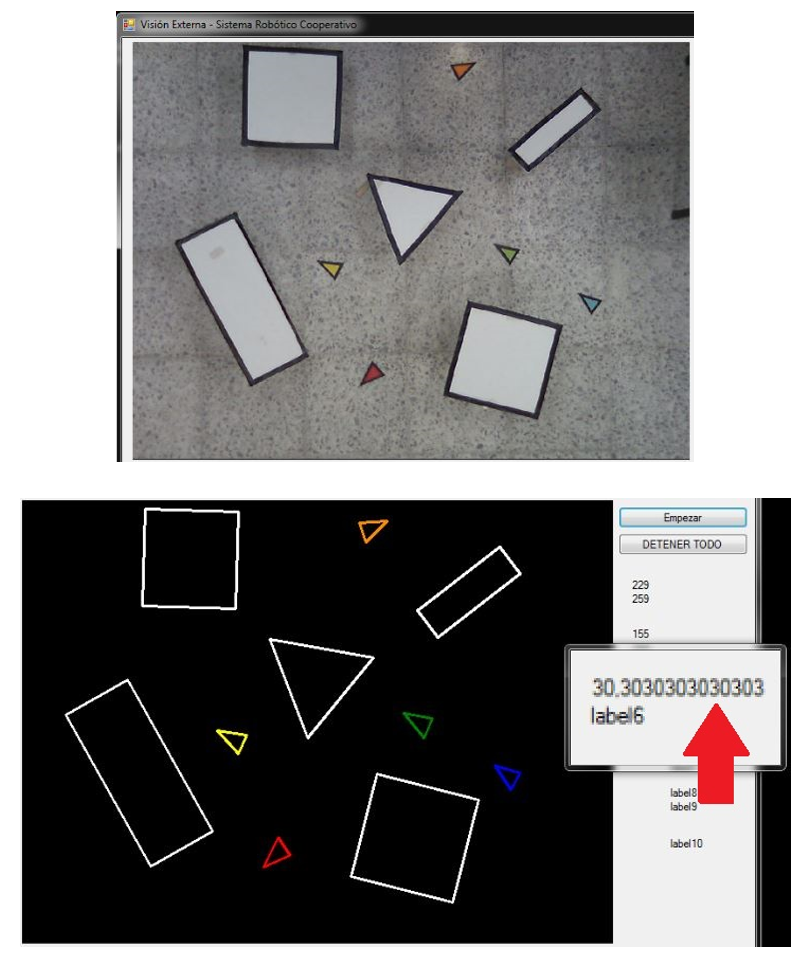

# Multi-robot-tracking
 

This project is a C# Windows Forms desktop application, which allows tracking multiple robots using an overhead camera feed, as well as communicating the corresponding motion commands to the robots.

In addition to the main thread, the application uses two additional threads devoted to image processing (using the EmguCV library) and ZigBee wireless communication with the robots. The application acts as an overseer agent, identifying the position and orientation of objects and humanoid robots (represented by colored triangles) within the workspace, and issuing the corresponding motion commands to direct the robots towards the nearest object. For more details, please read the corresponding [research paper](https://www.researchgate.net/publication/281542658_Desarrollo_de_algoritmo_para_deteccion_y_comando_de_robots_humanoides_en_tareas_de_recoleccion).

The source files in this project are registered on my behalf as former member of the [DAVINCI Research Group at Unversidad Militar Nueva Granada](https://www.umng.edu.co/sedes/bogota/facultad-de-ingenieria/centro-de-investigacion/davinci), and are thus confidential and for demonstration purposes only. Please refer to the [license](./LICENSE) for more details.

To interact with the simulation, you must install Visual Studio and perform the following steps:

1. Download all repository files.
2. In Visual Studio, choose the "Open project" option and choose the "Emgu1.slm" file.
